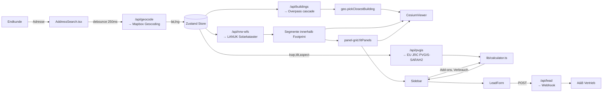

# Architektur — A&B PV-Konfigurator

Status: **v1 — Pilotregion Borken (NRW)**
Letzte Aktualisierung: 2026-04-26

---

## 1. Ziel

Endkunden-Konfigurator, der für jede deutsche Adresse (Pilot: NRW) in unter
fünf Sekunden ein 3D-Modell des Hauses zeigt, automatisch PV-Module auf
geeigneten Dachflächen platziert, Wirtschaftlichkeit berechnet und einen
Lead an den A&B-Vertrieb übergibt. Qualitätsmaßstab: RayDraft / Solarplaner.

## 2. Entscheidung: 3D-Visualisierung

Es wurden vier Pfade evaluiert. Drei sind nachweislich gescheitert oder nicht
zulassungsfähig, einer ist die strategische Lösung — und genau den baut diese
Codebasis durch.

| Pfad | Datenqualität | Kosten | Verfügbarkeit | Verdikt |
|------|---------------|--------|---------------|---------|
| Google Photorealistic 3D Tiles | sehr hoch | $7/1k Sessions | EEA-blocked für unseren Account trotz aktivierter Map Tiles API | ❌ verworfen |
| Cesium OSM Buildings (Asset 96188) | flache Box-Extrusionen, keine Dachformen | kostenlos | sofort | ❌ "kacke" (User-O-Ton) |
| MapTiler Streets v2 / OSM-Extrusion | flache Boxen | Free Tier ok | sofort | ❌ identisches Problem |
| **NRW LoD2 self-hosted (3D Tiles)** | **echte Dachformen (Walmdach, Satteldach, Pultdach, Mansarddach), Laserscan-genau** | **einmalige Konvertierung + Cloudflare R2 Storage (~5–15 €/Monat für ganz NRW)** | **kostenlos lizenzfrei (Datenlizenz Deutschland Zero 2.0)** | ✅ **gewählt** |

**Begründung**: Das Land NRW veröffentlicht offizielle LoD2-Gebäudemodelle für
das gesamte Bundesland kostenlos und kommerziell nutzbar. Eine einmalige
CityGML-→-3D-Tiles-Konvertierungspipeline liefert für jede NRW-Adresse echte
Dachgeometrie. Keine Google-Abhängigkeit, keine EEA-Sperre, keine monatlichen
Per-Session-Fees. Solarkataster-Polygone werden via Cesium
`Cesium3DTileStyle` + Classification direkt auf die Dächer projiziert →
visuell deckungsgleich.

Quelle:
- https://www.opengeodata.nrw.de/produkte/geobasis/3dg/3dgm_lod2/
- Format: CityGML 2.0
- Coverage: ganz NRW, ~700 GB roh, ~30 GB nach 3D-Tiles-Konvertierung mit
  Draco-Compression
- Lizenz: DL-DE→Zero-2.0

### Pipeline (siehe `scripts/lod2-pipeline/`)

```
NRW Open GeoData (CityGML)
        │   download
        ▼
 scripts/lod2-pipeline/1_download_citygml.sh
        │   citygml-tools → CityJSON
        ▼
 scripts/lod2-pipeline/2_convert_to_3dtiles.py  (py3dtiles + Draco)
        │   3D Tiles 1.1 mit LoD-Pyramide
        ▼
 Cloudflare R2 Bucket (public)  ←  scripts/lod2-pipeline/3_upload_to_r2.sh
        │
        ▼
 NEXT_PUBLIC_LOD2_TILESET_URL=https://lod2-nrw.r0.cloudflarestorage.com/.../tileset.json
        │
        ▼
 components/CesiumViewer.tsx  →  Cesium3DTileset.fromUrl(...)
```

### Kein Tileset gehostet → ehrlicher Fallback

Solange `NEXT_PUBLIC_LOD2_TILESET_URL` nicht gesetzt ist, zeigt die App **kein
Fake-3D mit OSM Buildings**. Stattdessen:

1. **Cesium-Viewer** lädt nur Cesium World Terrain + die NRW-Solarkataster-
   Polygone als auf-dem-Boden-projizierte Flächen (echte Geometrie und
   Eignungs-Farbcodierung, aber 2.5D).
2. Banner zeigt mit Action-Item: *"LoD2-Tileset für diese Region noch nicht
   gehostet. → Pipeline-Anleitung in `scripts/lod2-pipeline/README.md`."*

So bleibt die Anwendung jederzeit funktional, ehrlich, und der Pfad zur
Vollqualität ist offensichtlich.

## 3. Datenfluss



## 4. Verwendete Services + Kosten

| Service | Zweck | Kosten | Free Tier | Env Var |
|---------|-------|--------|-----------|---------|
| Mapbox Geocoding API | Adresssuche | $0.75 / 1k Requests | 100k / Monat | `MAPBOX_SECRET_TOKEN`, `NEXT_PUBLIC_MAPBOX_TOKEN` |
| Cesium Ion | World Terrain Asset | kostenlos | unlimited (Default-Token) | `NEXT_PUBLIC_CESIUM_ION_TOKEN` |
| Cloudflare R2 | LoD2 3D-Tiles Hosting | $0.015/GB/Monat + 0$ Egress | 10 GB Storage / 10M Class A Operations | (URL in `NEXT_PUBLIC_LOD2_TILESET_URL`) |
| Vercel | App Hosting | $0 Hobby / $20 Pro | 100 GB Bandwidth | — |
| LANUK NRW WFS | Solarkataster | kostenlos | — | (CORS-Proxy `NRW_WFS_PROXY` optional) |
| Overpass API | OSM Building Footprints | kostenlos | Rate-Limit | `OVERPASS_URL` optional |
| EU JRC PVGIS | Ertragsberechnung | kostenlos | unlimited | — |
| NRW Open GeoData | LoD2 CityGML | kostenlos | — | — |

**Summe Production**: typisch < $25/Monat bei < 10k Konfigurationen/Monat.

## 5. Datenschutz / DSGVO

Siehe [PRIVACY.md](./PRIVACY.md). Kurz:

- Adresse, lat/lng, Verbrauchsdaten verlassen den Browser nur für das Lead-
  Formular und für die externen APIs (Mapbox, PVGIS, Overpass, NRW WFS).
- Keine Cookies außer technisch notwendig.
- Kein Tracking, kein Analytics-Pixel ohne Consent.
- Externe API-Calls in der Datenschutzerklärung der WordPress-Seite zu
  ergänzen (Snippet in `wordpress/privacy-snippet.html`).

## 6. WordPress-Integration

Zwei Varianten — siehe `wordpress/`:

1. **iframe-Snippet** (`wordpress/iframe-snippet.html`): One-Liner für ein
   r-energy-Theme Custom-HTML-Block. Empfohlen.
2. **Standalone-Bundle** (`wordpress/standalone-snippet.html`): Direktes
   Embedding via Script-Tag, falls iframe nicht erwünscht. Lädt von der
   Vercel-URL.

Beide kommunizieren mit der WordPress-Seite via `postMessage` für
Höhen-Auto-Resize.

## 7. Nicht im Scope von v1

- Schattenanalyse (Bäume, Nachbarhäuser) — Phase 2, dann mit Cesium
  3D-Tiles + Sun-Position-Calculator
- Verschattungs-Simulation pro Modul — Phase 2
- Echtzeit-Preise von Modul-Herstellern — Phase 3
- Speicherauslegung dynamisch (statt Pauschale +€8000 / +EVQ 70%)
- Multi-Land (Bayern, Baden-Württemberg) — Phase 3, jeweils mit dem
  entsprechenden Landes-LoD2 (BAYERN: BVV, BW: LGL)

## 8. Wartungs-Anleitung — neue NRW-Kacheln nachhosten

Wenn NRW LoD2 ein Update veröffentlicht (typischerweise jährlich):

```bash
cd scripts/lod2-pipeline
# 1. neue Kacheln runterladen (delta-only via timestamp)
./1_download_citygml.sh --since 2026-01-01

# 2. konvertieren (parallelisiert, ~2h für ganz NRW auf 8-Core)
python 2_convert_to_3dtiles.py --input ./citygml --output ./3dtiles --draco

# 3. nach R2 hochladen mit Versionierung
./3_upload_to_r2.sh --bucket lod2-nrw --version $(date +%Y%m)

# 4. neue tileset.json-URL als Env Var in Vercel setzen, deployen
vercel env add NEXT_PUBLIC_LOD2_TILESET_URL production
vercel --prod
```

## 9. Was diese Codebasis explizit NICHT tut

- ❌ Cesium OSM Buildings als Fallback laden
- ❌ Photorealistic 3D Tiles als Default-Pfad
- ❌ Algorithmische Dach-Rekonstruktion aus 2D-Polygonen + tan(Neigung)
- ❌ Mock-Daten oder Lorem Ipsum
- ❌ Generische "Fehler"-Banner ohne Aktion
- ❌ Tracking ohne Consent
