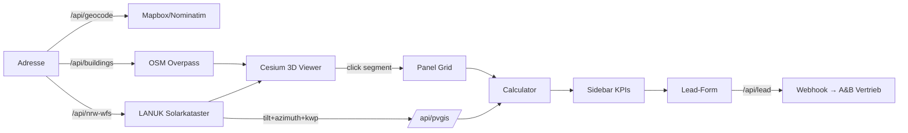

# A&B Solarenergy — PV-Konfigurator

Production-grade Photovoltaik-Konfigurator für die Pilotregion **Borken (NRW)**.
Adresse eingeben → echtes 3D-Modell des Hauses → automatische Modulbelegung →
Wirtschaftlichkeitsberechnung → Lead-Anfrage an A&B Vertrieb.

> Architektur-Entscheidung: NRW LoD2 self-hosted 3D Tiles. Volle Begründung in
> [ARCHITECTURE.md](./ARCHITECTURE.md). Was *nicht* funktioniert hat (Google
> Photorealistic, OSM Buildings, MapTiler Flat-Extrusion) ist dort dokumentiert.

---

## Quick start (lokal)

```bash
git clone https://github.com/akheyo/youman-automation
cd youman-automation
git checkout claude/pv-configurator-3d-XN7Kb

cp .env.example .env.local
# Mindestens NEXT_PUBLIC_CESIUM_ION_TOKEN setzen, optional Mapbox/PVGIS

npm install
npm run dev
# → http://localhost:3000
```

Ohne Cesium-Token startet der 3D-Viewer mit einem klaren Banner inkl. Aktion.
Ohne LoD2-Tileset zeigt der Viewer NRW-Solarkataster-Polygone auf
Cesium-World-Terrain (2.5D-Fallback) — keine OSM-Boxen, kein Fake-3D.

## Architektur in einem Diagramm



Volle Erläuterung in [ARCHITECTURE.md](./ARCHITECTURE.md).

## Projekt-Struktur

```
.
├── app/                       # Next.js 14 App Router
│   ├── api/                   # 5 server routes
│   │   ├── geocode/           # Mapbox primary, Nominatim fallback
│   │   ├── buildings/         # OSM Overpass (mirror cascade)
│   │   ├── nrw-wfs/           # LANUK Solarkataster
│   │   ├── pvgis/             # EU JRC yield calc
│   │   └── lead/              # Webhook forwarder
│   ├── embed/                 # /embed iframe variant + auto-resize
│   ├── privacy/               # DSGVO page
│   ├── layout.tsx
│   ├── page.tsx
│   └── globals.css
├── components/                # 10 React components, all client-side
│   ├── PVConfigurator.tsx     # orchestrator
│   ├── CesiumViewer.tsx       # 3D viewer (Cesium 1.123)
│   ├── AddressSearch.tsx
│   ├── Stepper.tsx
│   ├── Sidebar.tsx
│   ├── ConsumptionPanel.tsx
│   ├── AddonsPanel.tsx
│   ├── LeadForm.tsx
│   ├── ResultBanner.tsx
│   └── PdfExportButton.tsx
├── lib/                       # Pure logic, fully unit-tested
│   ├── calculator.ts          # PV economics
│   ├── nrw-wfs.ts             # LANUK WFS client
│   ├── pvgis.ts               # PVGIS client
│   ├── overpass.ts            # OSM client
│   ├── geo.ts                 # turf helpers
│   ├── panel-grid.ts          # module placement
│   ├── geocode.ts             # Mapbox + Nominatim
│   ├── lead.ts                # Webhook validation + HMAC
│   ├── lod2.ts                # Tileset config helpers
│   └── store.ts               # Zustand state
├── tests/
│   ├── *.test.ts              # Vitest unit tests (calculator, geo, panel-grid, lead, nrw-wfs)
│   └── e2e/smoke.spec.ts      # Playwright happy-path
├── scripts/lod2-pipeline/     # CityGML → 3D Tiles → Cloudflare R2
│   ├── 1_download_citygml.sh
│   ├── 2_convert_to_3dtiles.py
│   ├── 3_upload_to_r2.sh
│   ├── requirements.txt
│   └── README.md
├── wordpress/                 # iframe + standalone embed snippets
├── types/index.ts             # Domain types (TypeScript strict)
├── ARCHITECTURE.md            # Decision record
├── README.md                  # this file
└── package.json
```

## Verwendete Services

| Service | Zweck | Free-Tier-Grenze | Required |
|---------|-------|------------------|----------|
| Mapbox Geocoding | Adresssuche | 100k Req/Monat | optional (Nominatim-Fallback) |
| Cesium Ion | World Terrain | unlimited (Default-Token) | **ja** für 3D-Viewer |
| Cloudflare R2 | LoD2-Tileset hosten | 10 GB Storage / 10M Class A Operations | empfohlen für Production |
| Vercel | App-Hosting | 100 GB Bandwidth (Hobby) | empfohlen |
| LANUK NRW WFS | Solarkataster | unbegrenzt | **ja** |
| OSM Overpass | Building Footprints | rate-limit | **ja** |
| EU JRC PVGIS | Ertragsberechnung | unbegrenzt | optional (NRW-Default-Fallback) |

Erwartete Production-Kosten: **< $25/Monat** bei < 10k Konfigurationen/Monat.

## Tests

```bash
npm run typecheck            # TS strict check
npm run lint                 # ESLint
npm run test                 # Vitest (lib/* unit tests)
npm run test:coverage        # Vitest mit Coverage-Report (Ziel: 70% lines)
npm run test:e2e:install     # Playwright Browser einmalig installieren
npm run test:e2e             # Playwright smoke gegen `npm run dev`
```

Coverage-Schwellen (in `vitest.config.ts`): 70% lines/functions/statements,
65% branches. CI sollte bei Unterschreitung fehlschlagen.

## Production-Deployment

### Auf Vercel

```bash
vercel link                   # an Project binden (einmalig)
vercel env pull               # Env Vars von Vercel laden
vercel --prod                 # Production-Deploy
```

Custom Domain: `konfig.ab-solarenergy.de` als CNAME auf
`cname.vercel-dns.com` in der DNS-Zone konfigurieren, dann in
Vercel Project Settings → Domains hinzufügen.

### NRW LoD2-Tileset hosten

Das ist eine einmalige Operation pro Regierungsbezirk. Siehe
[scripts/lod2-pipeline/README.md](./scripts/lod2-pipeline/README.md).

Pilot Borken (~80 MB CityGML, ~5 min Konvertierung):

```bash
cd scripts/lod2-pipeline
python -m venv venv && source venv/bin/activate
pip install -r requirements.txt
./1_download_citygml.sh --bezirk muenster --gemeinde borken
python 2_convert_to_3dtiles.py --input ./citygml/borken --output ./3dtiles/borken --draco
./3_upload_to_r2.sh --bucket lod2-nrw --path borken
```

Resultierende URL als `NEXT_PUBLIC_LOD2_TILESET_URL` in den Vercel-Env-Vars
setzen, neu deployen → photorealistische Dachformen.

### WordPress-Integration

Zwei Snippets in `wordpress/`. Empfohlen: iframe-Variante in einen
"Custom HTML"-Block der Seite kleben. iframe-Höhe passt sich automatisch
via `postMessage` an.

## Lead-Webhook-Schema

`POST <LEAD_WEBHOOK_URL>` mit Body:

```json
{
  "name": "Max Mustermann",
  "phone": "+49 1234 567890",
  "email": "max@example.de",
  "timeframe": "sofort | 1-3-monate | 3-6-monate | spaeter",
  "message": "optional",
  "address": "Mölndalstraße 8, 46325 Borken",
  "lat": 51.84,
  "lng": 6.86,
  "consumption": {
    "kwhYear": 4500,
    "priceCtKwh": 35,
    "hasEAuto": false,
    "addons": { "storage": false, "wallbox": true, "heatpump": false }
  },
  "calculation": {
    "recommendedKwp": 7.2,
    "moduleCount": 18,
    "yearlyYieldKwh": 6840,
    "yearlySavingsEur": 1450,
    "investmentEur": 11580,
    "paybackYears": 8,
    "co2SavingsT": 2.97
  },
  "timestamp": "2026-04-26T15:30:00.000Z",
  "consent": true,
  "source": "iframe@ab-solarenergy.de"
}
```

Optional `X-Signature: sha256=<HMAC>` Header, falls `LEAD_WEBHOOK_SECRET` gesetzt.

A&B kann den Webhook auf einen Zapier/Make/HubSpot-Endpoint zeigen lassen.

## Datenschutz / DSGVO

Volle Erklärung unter `/privacy` (Source: [app/privacy/page.tsx](./app/privacy/page.tsx)).
Wichtigste Punkte:

- Keine Tracking-Cookies, kein Analytics ohne Consent
- Externe Services (Mapbox, Overpass, NRW WFS, PVGIS, Cesium Ion, R2) sind
  in der Datenschutzerklärung aufgeführt
- Lead-Daten werden nur bei explizitem Consent übermittelt
- Server-side IP-Logging nur via Vercel-Defaults (deaktivierbar)

## Wartung

### Neue NRW-Daten nachhosten

NRW veröffentlicht jährlich ein LoD2-Update. Delta-Update:

```bash
cd scripts/lod2-pipeline
./1_download_citygml.sh --since 2026-01-01
python 2_convert_to_3dtiles.py --input ./citygml --output ./3dtiles --incremental --draco
./3_upload_to_r2.sh --bucket lod2-nrw --sync
```

### Calculator-Konstanten anpassen

Alle Wirtschaftlichkeits-Konstanten zentral in
[`lib/calculator.ts`](./lib/calculator.ts) → `CALC` Objekt. Tests laufen
deterministisch durch — `npm run test` warnt sofort bei Regression.

## Bekannte Limits / Roadmap

- **Verschattungsanalyse**: aktuell nur über NRW LANUK Eignungs-Klassifizierung
  (sehr gut / gut / bedingt). Phase 2: pro-Modul Sun-Position-Tracking via
  Cesium SunLight.
- **NRW only**: Pilotregion. Bayern (BVV), BW (LGL) kommen mit Phase 3.
- **Speicher-Auslegung pauschal**: 10 kWh / +€8000. Keine kWp-abhängige
  dynamische Dimensionierung.
- **PDF-Export ohne Polygon-Render**: Map-Snapshot via html2canvas funktioniert,
  echtes Cesium-Snapshot mit Modulen ist Phase 2.

## Lizenz

Projekt-Code: proprietär (A&B Solarenergy).
NRW LoD2: DL-DE→Zero-2.0 (frei kommerziell nutzbar).
OpenStreetMap: ODbL (Quellangabe in Datenschutz).
